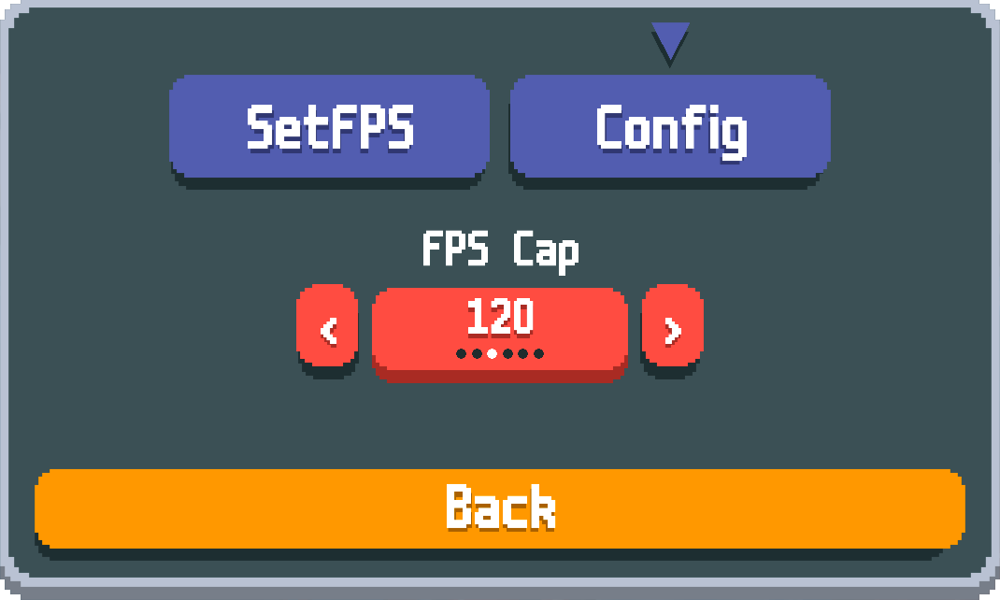

# Set FPS for Balatro

This mod allows you to dynamically set the FPS cap of Balatro, without having to manually edit the value of `FPS_CAP` in `main.lua`.  

If you're experiencing high battery drain or increased thermals while playing - this is likely the solution as the default value is `500`.

## Options

To select your desired FPS cap, open `Mods`, select `SetFPS`, then open the `Config` tab.

Available FPS caps: `30`, `60`, `120`, `144`, `240`, `Max (500)`.

## Setup

[Steamodded](https://github.com/Steamodded/smods) is required.  
Installation instructions are available in the [official documentation](https://docs.smods.dev/).

Place the latest release within the Mods directory:

### Windows

`%APPDATA%\Balatro\Mods`
> [!TIP]  
> You can use the shortcut `Win + R` and type in the directory.

### MacOS

`~/Library/Application Support/Balatro/Mods`
> [!TIP]  
> You can use shortcut `Cmd + Shift + G` and type in the directory.

### Example

`/Users/tanakrit/Library/Application Support/Balatro/Mods/SetFPS`

## Nexus Mods

[Balatro: Set FPS](https://www.nexusmods.com/balatro/mods/264)
